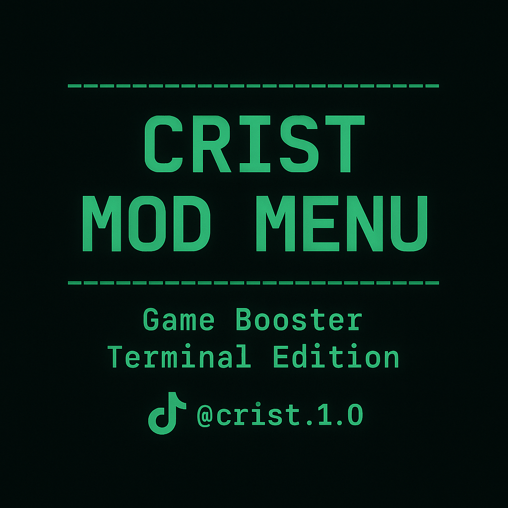

# 🎮 Crist MOD Menu

Menú visual tipo hacker para optimizar tu Android desde Termux (sin root).  
Incluye funciones como liberar RAM, cerrar procesos, desactivar animaciones y activar modo Gamer.

---

## 🖼️ Vista previa



---

## ⚙️ Funciones principales

✅ Cerrar procesos ocultos  
✅ Liberar memoria RAM  
✅ Desactivar animaciones  
✅ Activar modo ahorro de energía  
✅ Ver estado de CPU y RAM  
✅ Restaurar configuración original  
✅ Redirección a TikTok solo una vez  
✅ Acceso rápido con notificación flotante

---

## 📥 Clonar el repositorio

```bash
git clone https://github.com/hackcrist/Crist-Mod-Menu.git
```

```bash
cd Crist-Mod-Menu
```

---

## 🚀 Instalación

```bash
pkg update -y
```

```bash
pkg install termux-api -y
```

```bash
chmod +x crist-mod-menu.sh
```

```bash
./crist-mod-menu.sh
```

---

## 🧠 Acceso rápido (opcional)

```bash
bash launch-mod.sh
```

---

## 📲 Sígueme en TikTok

[@crist.1.0](https://www.tiktok.com/@crist.1.0?_t=ZN-8xKx4vMdkec&_r=1)
